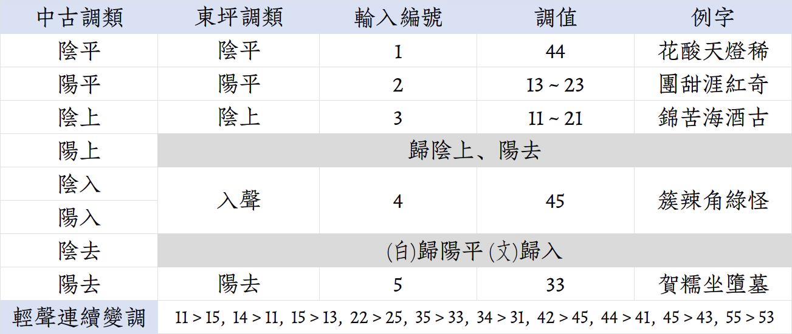

# rime_dongbbin
RIME 輸入方案：安化東坪話

湘語 婁邵片 湘雙小片 安化縣 東坪鎮

材料來自 [漢字音典](https://github.com/osfans/MCPDict)、[语保工程采录展示平台](https://zhongguoyuyan.cn/)、《[漢語方言用字規範](https://fangyanzi.vercel.app/)》、《現代漢語方言大詞典》、個人記錄。統一了一些記音細節。類推一些表中未收及的字音（謹慎使用）。

本輸入方案採用接近普通話拼音的轉寫方案，以利方言初習者。

本方案**不支持**數字鍵選詞，請用上下方向鍵選詞。 
或者你也可以刪掉第53行「`speller:alphabet`」後的「`12345`」，這樣就能用數字鍵選詞了。 
[oŋ] 與 [ɤŋ]，[ɸ][β] 與 [xu][ɣu]，[io] 與 [yo] 爲自由變體。輸入時可混淆。 
[n][l] 區分不穩定，第 114、115 行可以控制其是否混淆。

|IPA|轉寫|
|:---|:---|
|p pʰ b|b p bb|
|t tʰ d|d t dd|
|k kʰ|g k|
|ŋ|ng|
|x ɣ|h hh|
|ɸ β|f v 或 hu hhu|
|ts tsʰ z|z c zz|
|tɕ tɕʰ dʑ|j q jj|
|ɕ|x|
|ə e ɛ ɤ|e|
|ɤn|vn、v 或 e|
|ɿ|i|
|i u y|依漢拼寫法|

縣城的新派口音在上世紀受梅城話影響很大，語保平臺上的「單字」資料就有這個問題，但「詞彙」「例句」等都更正常，這是發音人口音不穩定導致的。本項目記錄的口音則是偏向老派的本地口音，原資料竄入了一些新派成分，在校對時已摘去。語保平臺上的聲調記錄很不理想，很多時候混淆了陰平和陽去，是完全錯誤的。同時也存在很多記音和類推錯誤，這是相關負責人員的失責。

|老派|新派|
|:---|:---|
|ɛn|e|
|ɤn|ɤ|
|oŋ (ɤŋ)|ən|
|ioŋ (iɤŋ)|in|
|ɣ|部分變爲 x|
|β|u|

---
附1：聲調表

附2：音節表
